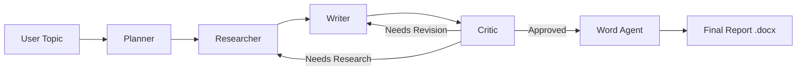

# Multi-Agent Research System (MARS)

A sophisticated multi-agent research system built with LangGraph, Agent Swarm, and Google AI Studio Gemini API. This system implements a collaborative workflow where specialized agents work together to produce comprehensive research reports in both JSON and Word (`.docx`) formats.

## System Architecture

The system follows the flowchart design with five specialized agents:

1. **Planner Agent**: Creates comprehensive research plans
2. **Researcher Agent**: Gathers and synthesizes information
3. **Writer Agent**: Creates detailed reports based on research
4. **Critic Agent**: Evaluates reports and provides feedback
5. **Word Agent**: Formats the final output into a professional Word document

### Workflow Flow



## Features

- **Multi-Agent Collaboration**: Specialized agents working together
- **Word Document Generation**: Automatically converts reports to formatted .docx files
- **Multi-Model Support**: Automatic fallback between multiple AI models
- **Rate Limit Handling**: Intelligent switching when models hit rate limits
- **Iterative Refinement**: Feedback loops for continuous improvement
- **Quality Control**: Built-in critique and approval system
- **Comprehensive Research**: Systematic approach to information gathering
- **Professional Reports**: Well-structured, detailed output
- **Configurable Limits**: Prevents infinite loops with iteration limits
- **Model Status Tracking**: Monitor and manage model availability

## Installation

### Clone the repository:

```bash
git clone <repository-url>
cd multi-agent-research-system
```

### Install dependencies:

```bash
pip install -r requirements.txt
```

> **Note:** This includes python-docx for Word generation.

### Set up environment variables:

```bash
cp env_example.txt .env
# Edit .env and add your Google API key
```

### Validate configuration:

```bash
python validate_config.py
```

## Configuration

### Environment Variables

Create a `.env` file with the following variables:

```env
# Basic configuration
GOOGLE_API_KEY=your_google_api_key_here
GEMINI_MODEL=gemini-1.5-pro

# Multi-model configuration file path
MODELS_CONFIG_FILE=models_config.json

# Optional: Multi-model fallback settings
MAX_MODEL_RETRIES=3
RATE_LIMIT_RETRY_DELAY=60
MODEL_SWITCH_DELAY=5
```

## Usage

### Basic Usage (CLI)

Run the system from the command line to generate a report.

```bash
# Generate a standard report (JSON only)
python main.py "Future of AI in Healthcare"

# Generate a report AND a Word Document (Recommended)
python main.py "Quantum Computing Trends 2024" --docx
```

### Advanced Usage

```bash
# With verbose logging to see agent thoughts
python main.py "Artificial Intelligence in Healthcare" --verbose

# With streaming progress updates (useful for long runs)
python main.py "Climate Change Solutions" --stream

# Save JSON to specific output file (Word doc auto-saves to outputs/)
python main.py "Quantum Computing" --output my_report.json --docx

# Check model status (Rate limits, availability)
python main.py --status

# Reset all models to available (if stuck in rate limit)
python main.py --reset-models
```

### Programmatic Usage

```python
from workflow import MultiAgentResearchWorkflow
from agents import WordAgent
from types import SimpleNamespace

# 1. Run the Workflow
workflow = MultiAgentResearchWorkflow()
result = workflow.run("Your research topic")

# 2. Generate Word Document manually
if result.get('final_report'):
    word_agent = WordAgent()
    # Create a state proxy compatible with the agent
    state_proxy = SimpleNamespace(
        final_report=result['final_report'],
        draft_report=result.get('draft_report'),
        user_topic="Your research topic"
    )
    docx_path = word_agent.convert_to_word(state_proxy)
    print(f"Document saved to: {docx_path}")
```

### HTTP API (FastAPI)

This repository includes a FastAPI wrapper (`api.py`) for building chatbots or web frontends.

**Start the server:**

```powershell
python -m uvicorn api:app --host 0.0.0.0 --port 8000
```

#### Endpoints

**1. Start Research (POST /research)**

Triggers the full workflow.

**Request Body:**

```json
{
  "topic": "Generative AI Trends",
  "generate_docx": true,
  "session_id": null,
  "stream": false
}
```

**Response:**

```json
{
  "result": {
    "final_report": "...text...",
    "docx_filename": "Generative_AI_Trends_report.docx",
    "download_url": "/download_report/Generative_AI_Trends_report.docx"
  }
}
```

**2. Download Report (GET /download_report/{filename})**

Download the generated Word document.

**URL:** `http://localhost:8000/download_report/Generative_AI_Trends_report.docx`

**3. Chat (POST /chat)**

Conversational endpoint that detects research intent.

**Request Body:** `{"message": "Hello", "session_id": null}`

**4. Status (GET /status)**

Check health and rate limits of Gemini models.

**Example Request (PowerShell):**

```powershell
# Start Research
$response = Invoke-RestMethod -Uri "http://localhost:8000/research" -Method Post -ContentType "application/json" -Body '{"topic": "SpaceX Starship", "generate_docx": true, "session_id": null, "stream": false}'

# Get Download URL
$filename = $response.result.docx_filename
Invoke-WebRequest -Uri "http://localhost:8000/download_report/$filename" -OutFile "Report.docx"
```

## Output Structure

The system generates the following outputs in the `outputs/` directory:

### 1. Research Reports (JSON)

Contains the full structured data, metadata, sources, and logs.

**Location:** `outputs/reports/report_Topic_Name_YYYYMMDD.json`

### 2. Word Documents (DOCX)

Professional formatted document ready for sharing.

Includes Title, Headings, Bullet points, and Formatted text.

**Location:** `outputs/Topic_Name_report.docx`

### 3. Logs

Detailed system logs for debugging.

**Location:** `outputs/logs/research_system.log`

## Quality Control & Limits

- **Rate Limits**: If the API hits a Google Rate Limit (429), the system will automatically pause and retry, or switch to a backup model if configured.
- **Iteration Limits**: Defaults to `MAX_ITERATIONS=10` to prevent infinite feedback loops between Writer and Critic.

## Troubleshooting

### Common Issues

**"Rate Limit Exceeded" / 429 Error:**

The system is hitting the free tier limit of Google Gemini.

- **Fix**: Wait 2-3 minutes or run `python main.py --reset-models`.
- **Fix**: Disable the Critic Agent in `workflow.py` to reduce API calls.

**PowerShell "curl" errors:**

PowerShell uses `Invoke-WebRequest` by default.

- **Fix**: Use `curl.exe` explicitly or use the `Invoke-RestMethod` syntax provided in the API section.

**Missing "outputs" folder:**

The system attempts to create this automatically. Ensure you have write permissions in the directory.

## Contributing

1. Fork the repository
2. Create a feature branch
3. Make your changes
4. Submit a pull request

## License

This project is licensed under the MIT License - see the LICENSE file for details.