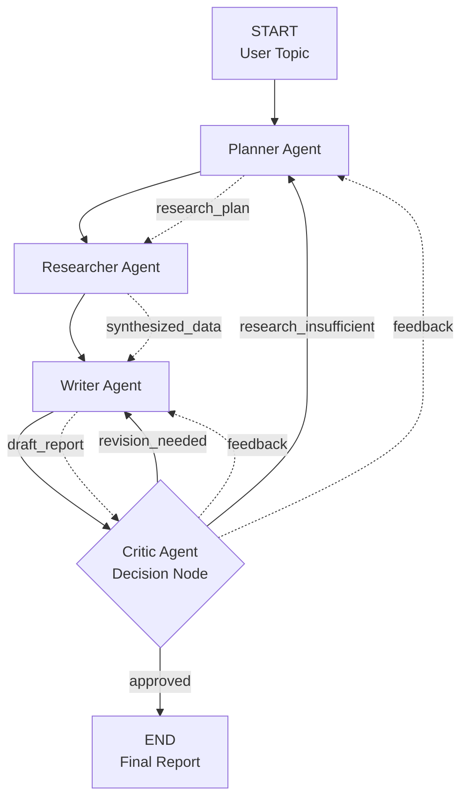

# Multi-Agent Research System Workflow

## System Architecture Diagram



## Detailed Workflow Flow

### 1. Planning Phase
- **Input**: User research topic
- **Agent**: Planner Agent
- **Output**: Comprehensive research plan
- **Process**: 
  - Analyze topic complexity
  - Identify key research questions
  - Define search strategies
  - Set research depth requirements

### 2. Research Phase
- **Input**: Research plan
- **Agent**: Researcher Agent
- **Output**: Synthesized research data
- **Process**:
  - Gather information from multiple sources
  - Analyze and synthesize findings
  - Identify conflicting information
  - Evaluate data quality

### 3. Writing Phase
- **Input**: Synthesized research data
- **Agent**: Writer Agent
- **Output**: Draft report
- **Process**:
  - Create structured report
  - Support claims with evidence
  - Ensure balanced coverage
  - Maintain professional quality

### 4. Critique Phase
- **Input**: Draft report
- **Agent**: Critic Agent
- **Output**: Evaluation and decision
- **Process**:
  - Evaluate report quality
  - Check completeness and accuracy
  - Provide constructive feedback
  - Make approval decision

### 5. Feedback Loops

#### Revision Loop (Writer → Critic → Writer)
- **Trigger**: Writing quality issues
- **Action**: Revise report based on feedback
- **Limit**: Maximum writing attempts

#### Research Loop (Critic → Planner → Researcher)
- **Trigger**: Insufficient research depth
- **Action**: Expand research based on feedback
- **Limit**: Maximum research attempts

#### Approval Path
- **Trigger**: Report meets quality standards
- **Action**: Finalize and deliver report
- **Result**: Complete research workflow

## Quality Control Mechanisms

### Iteration Limits
- **Maximum Iterations**: 10 (configurable)
- **Maximum Research Attempts**: 3 (configurable)
- **Maximum Writing Attempts**: 3 (configurable)

### Fallback Mechanisms
- **Error Handling**: Graceful degradation with fallback data
- **API Failures**: Automatic retry with alternative approaches
- **Timeout Protection**: Prevents infinite loops

### Progress Tracking
- **State Management**: Comprehensive state tracking
- **Progress Callbacks**: Real-time progress updates
- **Logging**: Detailed system logs for debugging

## Data Flow

### State Object Structure
```json
{
  "user_topic": "Research topic",
  "research_plan": "Structured research plan",
  "synthesized_data": "Processed research findings",
  "draft_report": "Generated report text",
  "critique_feedback": "Evaluation feedback",
  "approval_status": "approved|revision_needed|research_insufficient",
  "final_report": "Completed report",
  "current_iteration": 1,
  "research_attempts": 0,
  "writing_attempts": 0
}
```

### Agent Communication
- **Planner → Researcher**: Research plan with questions and strategies
- **Researcher → Writer**: Synthesized data with key findings
- **Writer → Critic**: Draft report for evaluation
- **Critic → Writer**: Revision feedback for improvements
- **Critic → Planner**: Research expansion feedback

## Error Handling Strategy

### Graceful Degradation
1. **API Failures**: Use fallback data and continue workflow
2. **Parsing Errors**: Create basic fallback responses
3. **Timeout Issues**: Implement retry mechanisms
4. **Resource Limits**: Enforce iteration and attempt limits

### Recovery Mechanisms
1. **Automatic Retry**: Retry failed operations with different parameters
2. **Fallback Data**: Provide basic responses when AI generation fails
3. **Progress Preservation**: Maintain workflow state across failures
4. **User Notification**: Clear error messages and progress updates

## Performance Optimization

### Efficiency Measures
- **Parallel Processing**: Concurrent agent operations where possible
- **Caching**: Store intermediate results to avoid recomputation
- **Streaming**: Real-time progress updates for long-running operations
- **Resource Management**: Monitor and limit API usage

### Scalability Considerations
- **Modular Design**: Easy to add new agents or modify existing ones
- **Configuration**: Flexible settings for different use cases
- **Extensibility**: Plugin architecture for custom agents
- **Monitoring**: Comprehensive logging and metrics collection
